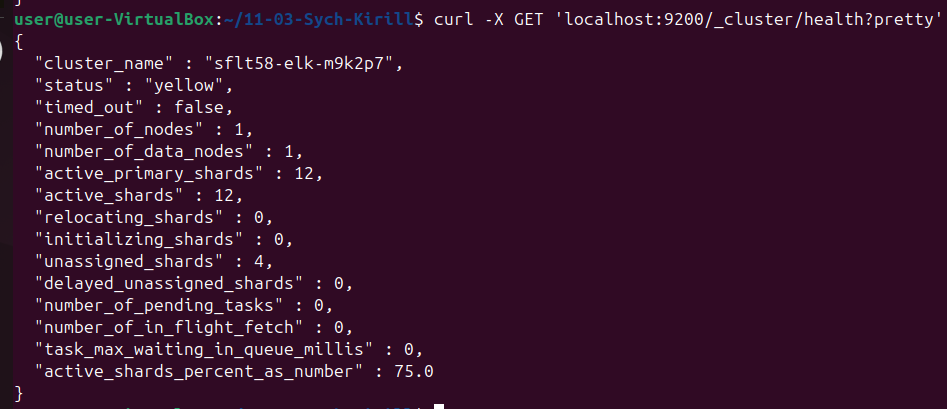
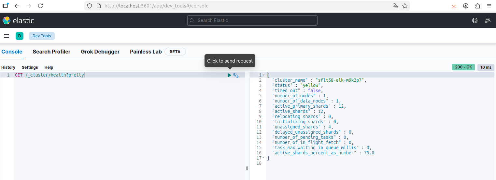
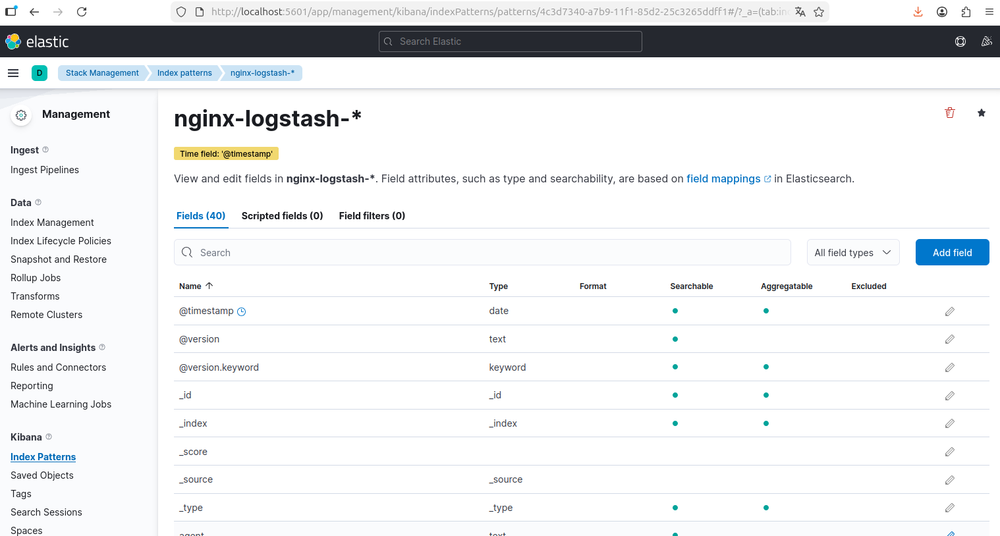
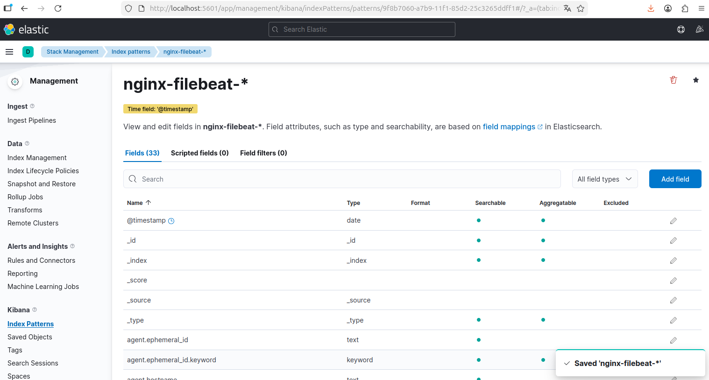
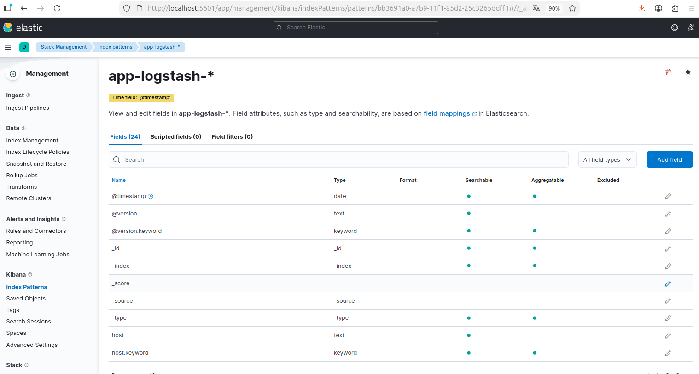

# 📊 Домашнее задание 11.03: ELK

**Выполнил:** Сыч Кирилл  
**Группа:** SFLT-58  
**Дата:** 3 сентября 2026

[](https://www.elastic.co/elasticsearch/)
[](https://www.elastic.co/kibana/)
[](https://www.elastic.co/logstash/)
[](https://www.elastic.co/beats/filebeat)

---

## 📋 Содержание

- [Структура проекта](#-структура-проекта)
- [Быстрый старт](#-быстрый-старт)
- [Задание 1: Elasticsearch](#-задание-1-elasticsearch)
- [Задание 2: Kibana](#-задание-2-kibana)
- [Задание 3: Logstash + Nginx](#-задание-3-logstash--nginx)
- [Задание 4: Filebeat](#-задание-4-filebeat)
- [Задание 5*: Другой сервис](#-задание-5-другой-сервис)
- [Push на GitHub](#-push-на-github)

---

## 📁 Структура проекта

```
11-03-Sych-Kirill/
├── docker-compose.yaml
├── elasticsearch/
│   └── elasticsearch.yml      # cluster.name = sflt58-elk-m9k2p7
├── logstash/
│   ├── pipelines.yml
│   └── pipeline/
│       ├── nginx.conf         # access-логи Nginx -> ES
│       └── app.conf           # логи demo-app -> ES
├── filebeat/
│   └── filebeat.yml           # Nginx + demo-app -> ES
├── nginx/
│   ├── nginx.conf
│   ├── html/index.html
│   └── logs/                  # access.log / error.log
├── app/
│   └── logs/service.log       # JSON-логи demo-app
├── scripts/
│   ├── setup.sh
│   ├── generate-traffic.sh
│   ├── switch-to-filebeat.sh
│   └── stop.sh
└── screenshots/               # сюда сохранить скриншоты
```

---

## 🚀 Быстрый старт

```bash
cd /home/user/11-03-Sych-Kirill

# один раз: Docker Compose v2 (если команда "docker compose" не работает)
sudo apt update
sudo apt install -y docker-compose-v2
docker compose version

# если vm.max_map_count < 262144
sudo sysctl -w vm.max_map_count=262144

bash scripts/setup.sh
```

| Сервис | URL |
|--------|-----|
| **Elasticsearch** | http://localhost:9200 |
| **Kibana** | http://localhost:5601 |
| **Nginx** | http://localhost:8080 |

Остановка:

```bash
bash scripts/stop.sh
```

---

## 🎯 Задание 1: Elasticsearch

### Что сделано

1. Elasticsearch поднят в Docker (`elasticsearch:7.17.9`)
2. Параметр `cluster.name` изменён на **`sflt58-elk-m9k2p7`**

Конфиг:

```yaml
# elasticsearch/elasticsearch.yml
cluster.name: sflt58-elk-m9k2p7
network.host: 0.0.0.0
discovery.type: single-node
xpack.security.enabled: false
```

### Проверка

```bash
curl -X GET 'localhost:9200/_cluster/health?pretty'
```

Ожидаемый фрагмент ответа:

```json
{
  "cluster_name" : "sflt58-elk-m9k2p7",
  "status" : "yellow",
  "number_of_nodes" : 1
}
```

### 📸 Скриншот




---

## 🎯 Задание 2: Kibana

### Что сделано

1. Kibana поднята в Docker (`kibana:7.17.9`)
2. Подключена к Elasticsearch: `http://elasticsearch:9200`

### Проверка

1. Откройте http://localhost:5601/app/dev_tools#/console
2. Выполните запрос:

```json
GET /_cluster/health?pretty
```

### 📸 Скриншот



---

## 🎯 Задание 3: Logstash + Nginx


| Компонент | Назначение |
|-----------|------------|
| **Nginx** | Пишет access-лог в `nginx/logs/access.log` |
| **Logstash** | Читает файл, парсит `COMBINEDAPACHELOG`, отправляет в ES |
| **Elasticsearch** | Индекс `nginx-logstash-YYYY.MM.dd` |

Pipeline:

```conf
# logstash/pipeline/nginx.conf
input {
  file {
    path => "/var/log/nginx/access.log"
  }
}

filter {
  grok {
    match => { "message" => "%{COMBINEDAPACHELOG}" }
  }
}

output {
  elasticsearch {
    hosts => ["http://elasticsearch:9200"]
    index => "nginx-logstash-%{+YYYY.MM.dd}"
  }
}
```

### Генерация логов

```bash
bash scripts/generate-traffic.sh
```

### Kibana: index pattern

1. **Stack Management → Index Patterns → Create**
2. Pattern: `nginx-logstash-*`
3. Time field: `@timestamp`
4. **Discover** → фильтр `shipper: logstash`

### 📸 Скриншот



---

## 🎯 Задание 4: Filebeat


Поставка access-логов Nginx переключена с Logstash на **Filebeat**.

Переключение:

```bash
bash scripts/switch-to-filebeat.sh
```

Скрипт:
1. отключает `logstash/pipeline/nginx.conf`
2. перезапускает Logstash и Filebeat
3. генерирует новый трафик

Filebeat отправляет логи в индекс `nginx-filebeat-YYYY.MM.dd`.

### Kibana: index pattern

1. Pattern: `nginx-filebeat-*`
2. **Discover** → фильтр `shipper: filebeat`

### 📸 Скриншот



---

## 🎯 Задание 5*: Другой сервис


Дополнительный сервис: **`demo-app`** — скрипт пишет JSON-логи в `app/logs/service.log`.

| Путь доставки | Индекс |
|---------------|--------|
| Logstash | `app-logstash-*` |
| Filebeat | `app-filebeat-*` |

Пример строки лога:

```json
{"timestamp":"2026-09-03T19:00:00+03:00","level":"INFO","service":"demo-app","message":"order processed","order_id":1}
```

**Приложение:** `demo-app` (сервис заказов, JSON-логи в файл).

### 📸 Скриншот



---

